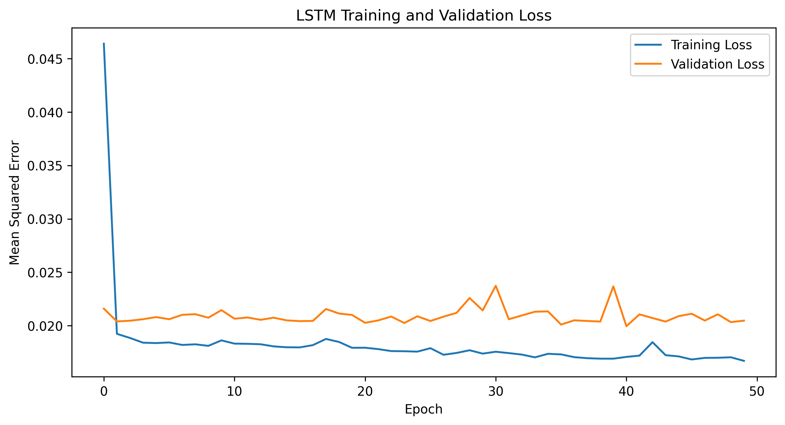
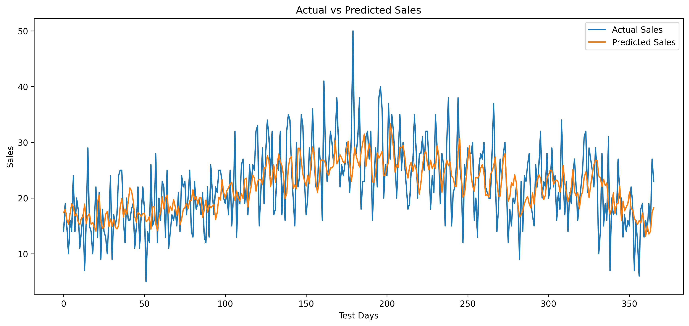

# LSTM-Based Sales Forecasting using TensorFlow/Keras

A Deep Learning project that uses a **Long Short-Term Memory (LSTM)** neural network to forecast future sales based on historical time-series sales data.

---

## 📌 Project Overview

Time-series forecasting is the process of predicting future values using previously observed data.

In this project, an **LSTM-based Deep Learning model** is developed to forecast daily sales.

The project demonstrates:

* Time-series data preprocessing
* Data normalization
* Sliding-window sequence creation
* LSTM model development
* Model training and validation
* Sales prediction
* Model evaluation using MAE and RMSE
* Visualization of actual vs predicted sales

---

## 🎯 Objective

Develop an **LSTM-based model for time-series forecasting** using a sales dataset.

The model learns patterns from historical sales data and predicts future sales values.

---

## 📊 Dataset

The project uses the **Store Item Demand Forecasting Challenge** dataset.

For simplicity, the project uses:

* **Store:** 1
* **Item:** 1
* **Time period:** 2013-01-01 to 2017-12-31
* **Total observations:** 1,826 daily records

### Dataset Columns

| Column  | Description              |
| ------- | ------------------------ |
| `date`  | Date of the sales record |
| `sales` | Number of units sold     |

The original dataset contains multiple stores and items. A single store-item combination is used to create a simple univariate time-series forecasting problem.

---

## 🧠 Model Architecture

The LSTM model consists of:

```text
Input Sequence
      │
      ▼
LSTM Layer (50 units)
      │
      ▼
LSTM Layer (50 units)
      │
      ▼
Dense Layer (1 unit)
      │
      ▼
Predicted Sales
```

### Model Configuration

* **Input:** 7 previous days of sales
* **LSTM Layer 1:** 50 units
* **LSTM Layer 2:** 50 units
* **Output Layer:** 1 neuron
* **Optimizer:** Adam
* **Loss Function:** Mean Squared Error
* **Epochs:** 50
* **Batch Size:** 32

---

## ⚙️ Data Preprocessing

The following preprocessing steps were performed:

### 1. Convert Date

The `date` column is converted into a Pandas datetime format.

### 2. Sort Data

The dataset is sorted chronologically.

### 3. Train-Test Split

The dataset is divided chronologically:

```text
80% → Training Data
20% → Testing Data
```

### 4. Feature Scaling

Sales values are normalized using:

```text
MinMaxScaler
```

The scaler is fitted only on the training data to avoid data leakage.

### 5. Sequence Creation

A **7-day lookback window** is used.

For example:

```text
Day 1 ─┐
Day 2  │
Day 3  │
Day 4  ├──► LSTM ──► Day 8 Prediction
Day 5  │
Day 6  │
Day 7 ─┘
```

The model uses the previous 7 days of sales to predict the next day's sales.

---

## 🛠️ Technologies Used

* Python
* TensorFlow
* Keras
* NumPy
* Pandas
* Matplotlib
* Scikit-learn
* Jupyter Notebook

---

## 🚀 Getting Started

### 1. Clone the Repository

```bash
git clone https://github.com/rohanbangar2509/Deep-Learning.git
```

Navigate to the project:

```bash
cd Deep-Learning/lstm-sales-forecasting
```

---

### 2. Create Virtual Environment

```bash
python -m venv .venv
```

Activate it on Linux/WSL:

```bash
source .venv/bin/activate
```

On Windows:

```bash
.venv\Scripts\activate
```

---

### 3. Install Dependencies

```bash
pip install -r requirements.txt
```

---

### 4. Run the Training Script

```bash
python src/train.py
```

The script trains the LSTM model and generates:

* Trained model
* Predictions
* Evaluation metrics
* Training loss graph
* Actual vs predicted graph

---

### 5. Run the Jupyter Notebook

Start Jupyter:

```bash
jupyter notebook
```

Open:

```text
notebooks/LSTM_Sales_Forecasting.ipynb
```

Run the notebook cells sequentially.

---

## 📈 Results

The trained LSTM model achieved the following results on the test dataset:

| Metric |  Value |
| ------ | -----: |
| MAE    | 4.3993 |
| RMSE   | 5.5430 |

### Training Loss



### Actual vs Predicted Sales



> Note: LSTM training can produce slightly different results between runs because of the stochastic nature of neural network training.

---

## 🔍 Project Workflow

```text
Sales Dataset
      │
      ▼
Data Cleaning
      │
      ▼
Date Conversion & Sorting
      │
      ▼
Train-Test Split
      │
      ▼
MinMax Scaling
      │
      ▼
Create 7-Day Sequences
      │
      ▼
LSTM Model
      │
      ▼
Model Training
      │
      ▼
Sales Prediction
      │
      ▼
Inverse Scaling
      │
      ▼
MAE & RMSE Evaluation
      │
      ▼
Visualization & Model Saving
```

---

## 📁 Repository Structure

```text
lstm-sales-forecasting/
│
├── data/
│   └── sales.csv
│
├── notebooks/
│   └── LSTM_Sales_Forecasting.ipynb
│
├── results/
│   ├── actual_vs_predicted.png
│   ├── training_loss.png
│   ├── lstm_sales_model.keras
│   ├── metrics.csv
│   └── predictions.csv
│
├── src/
│   └── train.py
│
├── .gitignore
├── README.md
└── requirements.txt
```

---

## 💾 Trained Model

The trained LSTM model is saved as:

```text
results/lstm_sales_model.keras
```

The model can be loaded using:

```python
from tensorflow.keras.models import load_model

model = load_model("results/lstm_sales_model.keras")
```

---

## 📚 Key Concepts Demonstrated

### Deep Learning

* LSTM Neural Networks
* Sequential Models
* Backpropagation Through Time

### Time-Series Forecasting

* Sequential data
* Sliding windows
* Lookback periods
* Future value prediction

### Data Preprocessing

* Data normalization
* Train-test splitting
* Sequence generation

### Model Evaluation

* Mean Absolute Error (MAE)
* Root Mean Squared Error (RMSE)

### Visualization

* Training loss
* Actual vs predicted values

---

## 🔮 Future Improvements

The project can be extended by:

* Using multiple stores and items
* Adding additional features
* Using longer lookback windows
* Comparing LSTM with GRU
* Comparing LSTM with traditional forecasting models
* Hyperparameter tuning
* Multi-step forecasting
* Deploying the model as an API
* Building a sales forecasting dashboard

---

## 👨‍💻 Author

**Rohan Bangar**

B.Tech — Computer Science & Engineering (Artificial Intelligence)

Vishwakarma Institute of Technology, Pune

---

⭐ If you find this project useful, consider giving the repository a star!
